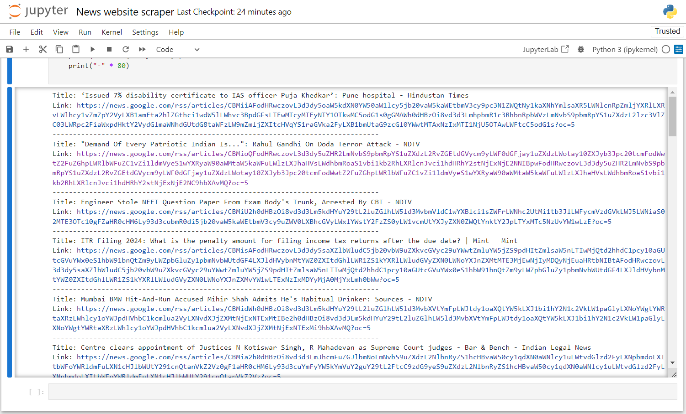

# Google News RSS Scraper

This project uses Python and the `feedparser` library to fetch and parse an RSS feed from Google News. Here's a breakdown of how it operates:

1. **RSS Feed URL**: The project starts by defining the URL of the Google News RSS feed (`https://news.google.com/rss`).

2. **Parsing the RSS Feed**: It uses `feedparser.parse(rss_url)` to fetch and parse the RSS feed data.

3. **Extracting Data**: The script iterates through the entries in the parsed feed (`feed.entries`), extracting and printing the titles and links of the articles.

4. **Output**: For each article entry, it prints the title and the corresponding link.

This project showcases basic RSS feed parsing capabilities in Python, demonstrating how to retrieve and utilize data from an external source like Google News.

